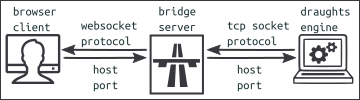

Webclient for 10x10 draughts
----------------------------
Play against your favorite draughts engine like MobyDam.  
Move pieces on the board by point and click.  
This browser client and a draughts engine can be directly connected if the engine uses the Websocket protocol.   

Often draughts engines use the Tcp Socket protocol. But browser clients do not understand this protocol.  
To solve this problem an intermediate server has to put between client and engine.   
This server acts as a bridge for the messages between the client and the engine.  

One great advantage of using a browser client is that you are independent of the operating system like
Linux, Windows and Mac.  
The price you have to pay is the use of a bridge server.  
Until draughts engines are designed to communicate directly with a browser client.  
But it does not cost you anything, because the bridge server application is free to download.  

Links
-----
Use these links to setup an environment where you can play against the draughts engine MobyDam.
- [Github MobyDam Draughts engine](https://github.com/rhalbersma/mobydam)
- [Github Web2Tcp Bridge Server](https://github.com/akalverboer/web2tcp_bridge)
- [Website WsDam webclient](http://svg_experimenten.deds.nl/wsdam/wsdam.html)

